# NeuroRoute
> **AI-Driven High-Concurrency Network Packet Optimizer**

NeuroRoute is a high-performance network simulation environment and command-line utility designed to replace traditional, static network routing protocols (such as Round-Robin or OSPF) with a localized, lightweight Reinforcement Learning (RL) agent.

The system simulates heavy network traffic—generating thousands of mock packets per second across arbitrary topologies—using an asynchronous, thread-safe Python core. Concurrently, an integrated RL agent observes queue depths, link latencies, and drop rates to dynamically route traffic around bottlenecks and packet hot spots in real time.

---

## 🚀 Key Features

*   **Concurrent Packet Simulation:** An asynchronous, thread-safe data plane capable of processing thousands of mock packets per second using Python's `asyncio` combined with thread pools and lock-free queues to bypass the Global Interpreter Lock (GIL).
*   **Lightweight RL Engines:** Supports both tabular Q-learning and Deep Q-Networks (DQN) optimized to execute microsecond-level routing actions.
*   **Dynamic Topology Evaluation:** Parses custom node topologies via YAML/JSON configuration files, enabling evaluation on trees, rings, or complex meshes.
*   **Terminal User Interface (TUI):** A real-time, interactive terminal dashboard powered by `rich` and `curses` to visualize packet flow, queue buffers, and dropping trends.
*   **Chaos Engineering Sandbox:** Simulates chaotic network elements such as sudden link failures, capacity degradation, and surge flows.

---

## 🛠️ Technology Stack

*   **Core Logic:** Python (3.9+)
*   **Concurrency:** `asyncio`, `concurrent.futures`
*   **AI/RL Frameworks:** PyTorch, Gymnasium (OpenAI Gym compatible)
*   **Networking / IPC:** ZeroMQ (`pyzmq`), `socket`
*   **CLI / Visualizer:** `click`, `rich` (Live Display), `curses`
*   **Testing:** `pytest`, `pytest-asyncio`

---

## 📁 Module Architecture

```
neuroroute/
├── router/
│   ├── plane.py          # Asynchronous data plane; handles packet queues, buffers, and forwarding.
│   └── generator.py      # Traffic generator utilizing Poisson distribution model.
├── ai/
│   ├── agent.py          # RL Agent definitions (Q-tables, PyTorch DQN models).
│   └── env.py            # Gymnasium wrapper mapping network state to observation space.
├── network/
│   ├── topology.py       # Configuration parser, graph managers, and adjacent link metrics.
│   └── algorithms.py     # Dijkstra's shortest path and Round-Robin baselines.
├── cli/
│   ├── simulate.py       # Entrypoint; orchestrates the main simulation loop.
│   └── tui.py            # Dashboard rendering using rich.live.
└── tests/                # Unit, integration, and performance benchmarks.
```

---

## 📈 6-Week Development Timeline

```mermaid
gantt
    title NeuroRoute Development Timeline (6 Weeks)
    dateFormat  X
    axisFormat  Week %d

    section Sprint 1: Setup
    Scaffolding & DevOps Setup (All)  :active, 1, 7
    Data Plane Interfaces (A)         :active, 1, 7
    Gym Env Blueprint (B)             :active, 1, 7
    CLI Scaffold (D)                 :active, 1, 7

    section Sprint 2: Core Plane
    Async Router queues (A)           : 8, 14
    Topology Parser (C)               : 8, 14
    Dijkstra Baselines (C)            : 8, 14
    Static Path Tests (A, C)          : 8, 14

    section Sprint 3: Gym & Agent
    Gym Observation/Reward (B)        : 15, 21
    Q-Learning Agent (B)              : 15, 21
    CLI Integration (D)               : 15, 21
    E2E Multi-Node Tests (A, B)       : 15, 21

    section Sprint 4: AI & Chaos
    DQN PyTorch Model (B)             : 22, 28
    Poisson Traffic Gen (A)           : 22, 28
    Dynamic Link Chaos (C)            : 22, 28
    TUI Layout Scaffold (D)           : 22, 28

    section Sprint 5: Optimization
    TUI Metrics Binding (D)           : 29, 35
    Queue Locking Optimization (A)    : 29, 35
    DQN Inference & GIL Bypass (B)    : 29, 35
    Multi-Agent Coordination (All)    : 29, 35

    section Sprint 6: QA & Demo
    Benchmarking Suite (A, B)         : 36, 42
    Mermaid Docs & Readme (C, D)      : 36, 42
    Code Freeze & Coverage (All)      : 36, 42
    Live SURGE Demo Script (All)      : 36, 42
```



---

## 👥 Contributor Expectations & Splits

*   **Contributor A (Data Plane & Queues):** Implements asynchronous packet queues, buffer drop logic, lock-free performance optimizations, and the Poisson traffic generator.
*   **Contributor B (RL Training & Models):** Formulates the Markov Decision Process (MDP), completes the Gymnasium interface, implements Q-Learning and PyTorch DQNs, and optimizes AI inference times.
*   **Contributor C (Network Topology & Chaos):** Develops the topology graph manager, parses configurations, implements static shortest-path algorithms, and writes the network chaos injection utilities.
*   **Contributor D (CLI & Visualizer):** Designs the primary command-line parser, orchestrates the main simulation loop, and builds the real-time interactive terminal (TUI) dashboard.

---

## ⚙️ Branching & Collaboration Protocol

To maintain high code quality and follow a structured Software Development Life Cycle (SDLC):

1.  **Branch Naming Convention:**
    Create a separate branch for every issue using the following format:
    `feature/week-<num>/issue-<num>-short-description`
    *Example:* `feature/week-2/issue-5-async-router-node`

2.  **Pull Requests & Merging:**
    *   PRs must target the `main` branch.
    *   Include `Closes #<issue_number>` in the PR description to link and close the issue automatically.
    *   Require at least **one peer review** approval before merging:
        *   *Contributor A* and *Contributor C* review each other's work (Data Plane / Network).
        *   *Contributor B* and *Contributor D* review each other's work (AI Models / CLI / UI).

---

## 🚀 Getting Started

### Prerequisites
*   Python 3.9 or higher
*   PyTorch (compiled with CUDA or Metal depending on hardware)

### Installation
1. Clone the repository:
   ```bash
   git clone https://github.com/AnmolM-777/NeuroRoute_SOR26.git
   cd NeuroRoute_SOR26
   ```

2. Install dependencies:
   ```bash
   pip install -r requirements.txt
   ```

3. Run tests:
   ```bash
   pytest
   ```
